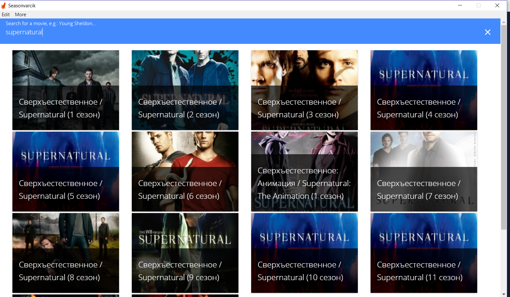
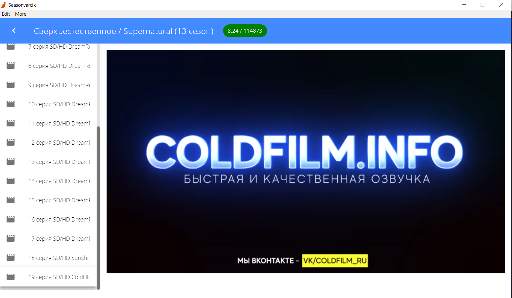

seasonvarcik
============

`seasonvarcik` is an [Electron](http://electron.atom.io) based desktop application for
viewing any movies (even blocked in your country) from [Seasonvar.ru](http://seasonvar.ru) stress free!

> Built using [seasonvar-api-nokey](https://github.com/AlexanderC/seasonvar-api)

# Screenshots




# Installation

1. Download [latest release](https://github.com/AlexanderC/seasonvarcik/releases/latest).
2. Install it or use portable version

# Development

Prerequisites:

- Node.js >=8.x

Installation:

```bash
npm install
```

Development:

```bash
npm run watch:ui
npm run start
```

Distribution:

```bash
npm run build
```
# Roadmap

- [ ] Add support for i18n
- [ ] Allow choosing episode's sound column (translation)
- [ ] Add some abstractions
- [ ] Add multiple providers
- [ ] Add realtime video processing (ML?) to skip builtin ads.

# Support development

I really love open source, however i do need your help to
keep the library up to date. There are several ways to do it:
open issues, submit PRs, share the library w/ community or simply-

<a href="https://etherdonation.com/d?to=0x4a1eade6b3780b50582344c162a547d04e4e8e4a" target="_blank" title="Donate ETH"></a>